# Archify-схема TODO — Value / Cost / Impact

Источник: `docs/todo.md` (ревизия `1959b89`), сделано 19/32. Метод: `.agents/skills/archify-review/SKILL.md`.
Легенда: Value — польза/частота; Cost — реализация + поддержка (S/M/L); Impact — затронутые модули.

## Приоритизация (порядок делать)

```mermaid
flowchart LR
  Race[Транзакция slotId] --> Bookings[GET /api/bookings]
  Bookings --> Success[Экран успеха]
  Success --> Comment[Комментарий]
  Comment --> README[README]
  README --> Calendar[Сетка календаря]
  Calendar --> Gen[Генерация слотов]
  Gen --> TZ[Таймзона UTC]
  TZ --> Dash[Dashboard]
  Dash --> Hosts[hosts/rules API]
```

## Таблица решений

| # | Пункт TODO | Value | Cost | Impact | Вердикт |
|---|---|---|---|---|---|
| 1 | Транзакция / unique index `bookings.slotId` | Высокое: двойные брони при параллельных POST, прямое нарушение спеки (§exclusion) | S: `UNIQUE(slotId)` + обработка 409, 1 миграция + тест на race | `server/db/schema.ts`, `server/app.ts`, `server/app.test.ts`; повышает надёжность, coupling не растёт | **Делать первым** |
| 2 | `GET /api/bookings` | Среднее: нужен только будущей панели организатора, сейчас потребителей нет | S: один route + тест inject | Только `server/app.ts` + тест; потребителей фронта нет — изолировано | **Делать вторым** (дешёвый фундамент) |
| 3 | Экран успеха вместо тоста | Высокое: подтверждение брони — ключевой UX спеки, сейчас только тост | M: новая страница/состояние + сводка + тест RTL | `src/pages/`, `src/hooks/use-booking`, `src/api/client.ts`; улучшает UX без ломки API | **Делать третьим** |
| 4 | Поле «комментарий» | Среднее: есть в спеке, используется редко | S–M: колонка БД + ALTER + zod-зеркало + поле формы + тест | `server/db/schema.ts`, `server/validation.ts` ↔ `src/lib/validation.ts`, форма; миграция обратима | **Делать 4-м** |
| 5 | `README.md` (установка, запуск, asciinema) | Среднее: нужно Hexlet-проверке и онбордингу, на рантайм не влияет | S: только текст | Только `README.md`; риск нулевой | **Делать 5-м**, параллельно с кодом |
| 6 | Месячная сетка календаря | Среднее: UX-навигация, без неё сервис работает списком | M: календарный компонент + фильтр по дате в API | `src/pages/`, `src/hooks/use-availability`, `GET /api/slots?date=`; тянет изменение API | **После 1–5** |
| 7 | Генерация слотов по правилам | Высокое для спеки (§4.1), низкое для текущего MVP (сид работает) | L: движок правил (часы, буфер, minNotice) + тесты | `server/db/`, сид, API слотов; самая рискованная смена логики | **После календаря**, отдельным ADR |
| 8 | Таймзона + UTC | Среднее: баги времени редки, но болезненны | M: хранение UTC + селектор + конверсия отображения | Фронт + бэк (формат `startAt`); требует договорённости о формате (ADR) | **Вместе с генерацией** |
| 9 | `/dashboard` (список, отмена, настройки) | Среднее: нужно организатору, не гостю | L: новая зона UI + `DELETE /api/bookings/:id` + auth-заглушка | Новый модуль; без auth — полумера | **Отложить** до решения по auth/хостам |
| 10 | `hosts`, `availability_rules`, `/api/v1/hosts/:slug/...` | Низкое сейчас (мульти-хост не нужен MVP), высокое для спеки | L: новые таблицы, версионирование API, миграции | Ломает схему БД и API-контракт; максимальный coupling | **Отложить**, только по требованию спеки |
| 11 | `422` вместо `400` | Низкое: косметика кода статуса, фронт уже обрабатывает 400 | S: замена статуса + правка тестов | `server/app.ts`, `server/app.test.ts`, `src/api/client.ts`; либо зафиксировать отклонение в ADR | **Дешёвый тикет**, взять с README |
| 12 | `.ics` / Google Calendar + ссылка отмены | Низкое: приятный бонус, не блокер | M: генератор ics + экран успеха + токен отмены | Зависит от №3 (экран успеха); без отмены — половинчато | **После экрана успеха** |
| 13 | ESLint warning `button.tsx` | Низкое: warning, не ошибка, shadcn-паттерн | S: `export` + eslint-disable или реэкспорт | Только `src/components/ui/button.tsx` | **Взять за 5 минут** с любым PR |

## Что не делать сейчас

- Мульти-хост (`hosts/rules`, `/dashboard` с auth) — нет потребителя, высокая цена, высокий coupling. Только после MVP.
- Движок генерации слотов — до фиксации правил в ADR и календаря; иначе переделки.

## Нерешённые вопросы

1. Формат времени в API после перехода на UTC (ISO + `timeZone`?) — нужен ADR.
2. `400` vs `422` — менять код или зафиксировать отклонение от спеки?
3. Отмена брони: нужен ли токен в ссылке, срок жизни?
